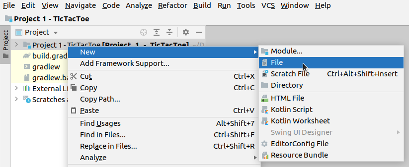
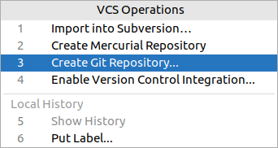
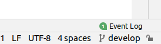

# Set Up Git Repository

## Gitignore

Some files / directories need to be excluded from repository, as they are not part of the source of the Project.
These files are typically the built binaries, cache or temporary files or configuration that is only valid on
a given workstation.

We are utilizing IntelliJ's Git managing capabilities here, but all steps can be completed through command
line as well. Just make sure that IntelliJ creates its own ```.idea/gitignore``` file and if it does not,
add it manually. 


Add a file to your project root named ```.gitignore``` with the following content:
```
.gradle
build
```




## Git init

### Init with IntelliJ





### Check .idea/.gitignore


### Init via command line (git shell)
```
cd <path to project root>
git init
```

## Add Files to Repository

### With IntelliJ


When prompted, choose *Fix and Commit*


Review code analysis warnings. You may ignore them for now and just click *Commit*. We will fix them later.


### Via command line
```
git add --all
git commit -m "initial commit"
```

This initializes our repository with ```master``` (or ```main``` with newer Git) branch.

Check the status:
```
$ git status
On branch master
nothing to commit, working tree clean
```

## Set Up Develop Branch
### IntelliJ

Open *Git -> New branch...* menu, then:


Check current branch in the bottom-right corner of IntelliJ


### Command line
```
git checkout -b develop
```


## Set Up Feature / Bugfix Branch
While it seems too much overhead, it is worth setting up short-lived feature / bugfix / release branches
to better organize changes to source code.

The basic idea is that development is done on ```topic branches```. Topic branches in most cases branch off of
```develop```, and in most cases they are merged back into ```develop``` as well. 
Check out [A successful Git branching model](https://nvie.com/posts/a-successful-git-branching-model/)
for details.


Our first feature branch, for instance, could be ```task/code-cleanup```


