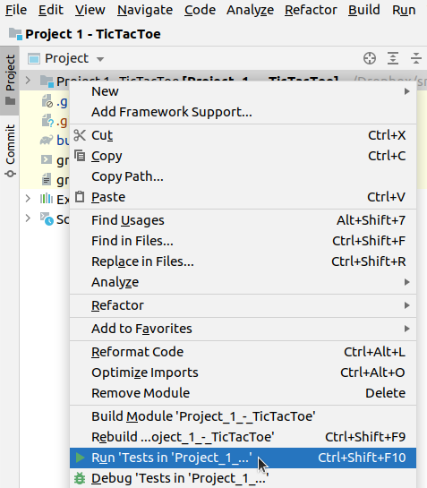
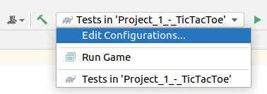
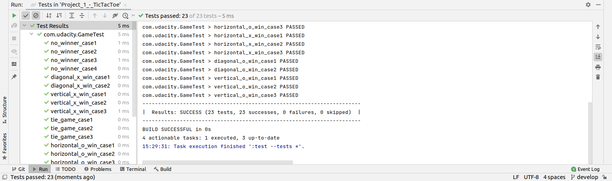

# Run Tests in IntelliJ

Even though Udacity's TicTacToe repository contains all the tests required readily available,
it fails to mention in the course how to *actually run them*.

## Set Up Test


## Command Line

Run ```gradle test``` command in your project root.




Now you should be able to either run tests or the game.




Test results should be available after a test run:




