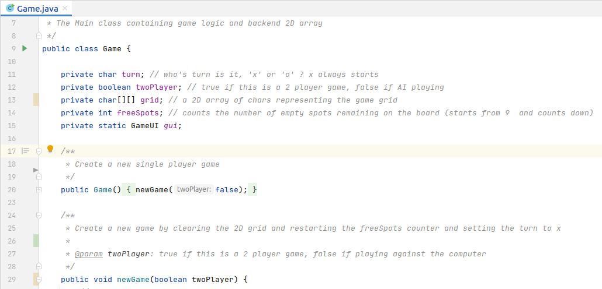
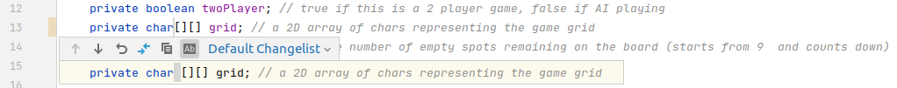
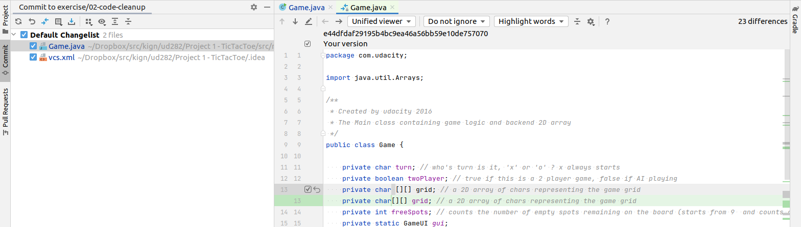

# Reformat Code

Code formatting, part of *Coding Standards* or
[Coding Conventions](https://en.wikipedia.org/wiki/Coding_conventions),
might seem to be purely aesthetic and is subject to ones personal liking.
Code formatting does not affect the syntax or the logic of the code, but can greatly
contribute to *code readability*. When you work alone, this is totally up
to what is best readable *for you*.

But when you work in a team, or better yet, contribute to an open source project,
it is a good practice to follow the given project's coding standards, or if
there is not one, follow the given programming language's coding standards.

Those standards articulate 'nice to have', 'good to have' and 'must have' rules.
You may always deviate from rules on your own discretion, but it is important
to know about the rules, and only override them for a reason.

IntelliJ is a very capable development environment. One of its great features is
*[Reformat Code](https://www.jetbrains.com/help/idea/reformat-and-rearrange-code.html#reformat_code)*.
It comes with preconfigured *Coding Style* you can tailor to your
needs and apply with a few clicks or keyboard shortcut.


## Reformat Code

You can reformat part of a code in a file, a whole file or a group of files with IntelliJ.
In this example we are going to reformat whole files, one by one, and observe the
difference with the help of Git.

1. Open Java files in your project, one by one.
1. Choose menu Code -> Reformat Code or press ```ctrl+alt+l``` in each file

The complete list of changed files: ```Game.java```, ```GameUI.java``` and ```GameTest.java```


## Review Uncommitted Changes in IntelliJ

The changes might not be obvious, but IntelliJ helps to pinpoint them.

### View Changes in the Editor

On the left side of the editor window, next to the line numbers, there is indication of changes:

* orange bar: changed line
* green bar: added line
* grey arrowhead: deleted line



Click on either one of them brings up a menu to show what has been changed. In this menu, change can also be rolled back.




### View Changes before Committing

When you commit your changes, you can view them file by file.

1. press ctrl-k to bring up Commit menu
1. double click* on any of the changed files in the left bar to view changes.



If you prefer a side-by-side comparision, you can do so by chosing 'side-by-side' instead of 'unified'.

\**You need to double-click only once, then you can view other files with a single click while in the Commit menu*


## List of Notable Changes

* missing newlines are added in method javadoc block
* missing spaces are added where needed to operators, operands, parenthesis, brackets, braces etc.


## Wait, there is more...
IntelliJ is capable of correctly formatting not only Java files, but other standard files as well.

Open ```build.gradle```, and do ```ctrl+alt+l```.

*Do not worry about IntelliJ warning of ```debug``` section for now.* 
