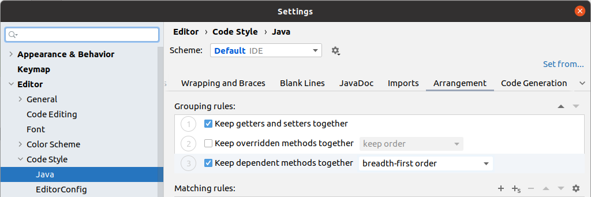

# Rearrange Code

Code arrangement is also part of *Coding Standards*. It is about in which order variables and methods are in a given source file.
An example order would be:

1. public variables
2. private variables
3. constructor method(s)
4. public methods
5. private methods.

There are other considerations as well, for instance

* the [Top-down narrative](https://grysz.com/2015/11/13/reformat-java-code-in-intellij-according-to-uncle-bobs-stepdown-rule/) 
  promoted by Clean Code advocate [Robert C. Martin](https://en.wikipedia.org/wiki/Robert_C._Martin), which states that 
  *high-level, abstract paragraphs should come first, then dive into details.*
* keeping *setters* and *getters* together
* keeping dependent methods together, and either in *depth first* or *breadth-first* order
* etc.

## Rearrange Code with IntelliJ

For this exercise, we will be using the default IntelliJ settings except that
we enable *Keep dependent methods together* with *breadth first* order.

1. Open each Java source code file one by one
1. Choose Code -> Rearrange Code menu*

*There is no keyboard shortcut by default, but you can assign one in IntelliJ settings.