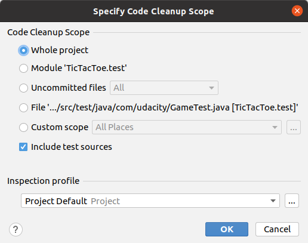
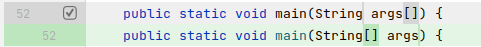
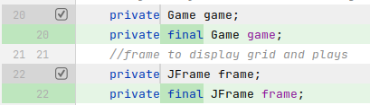

# Code Cleanup

IntelliJ has a function called Code Cleanup. This tries to apply quick fixes to problems it finds in code.
**Use it with care, and always review changes.** Run the game and the tests to see if everything is in order.
It cannot (and should not) fix each and every warning there is.




Changes made by code cleanup:

* fix C language style method argument notation to be Java style

    

* add ```final``` qualifier to certain variables

    
    
    
[More about *final* keyword](https://www.geeksforgeeks.org/final-keyword-java)