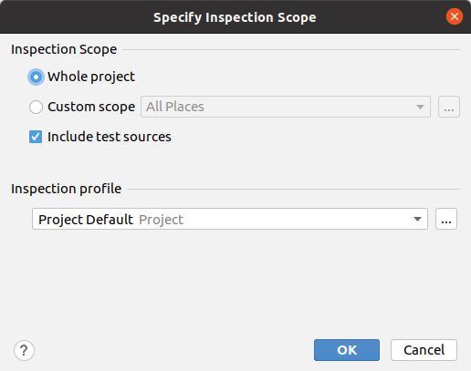
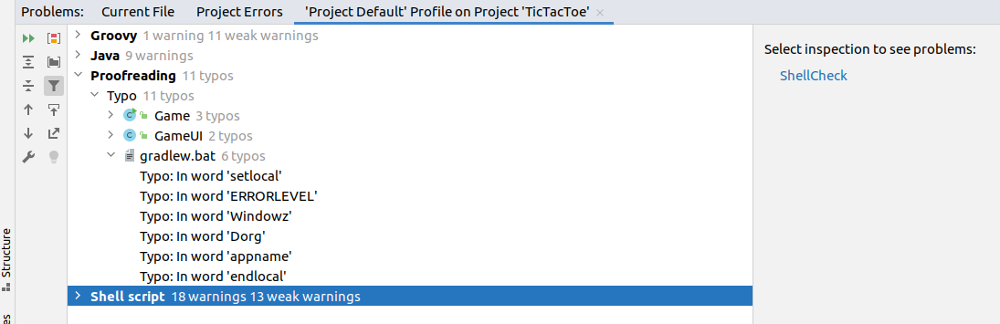
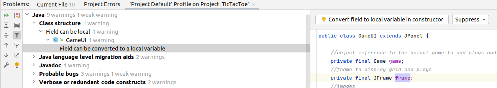
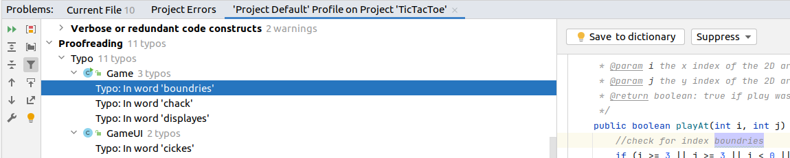
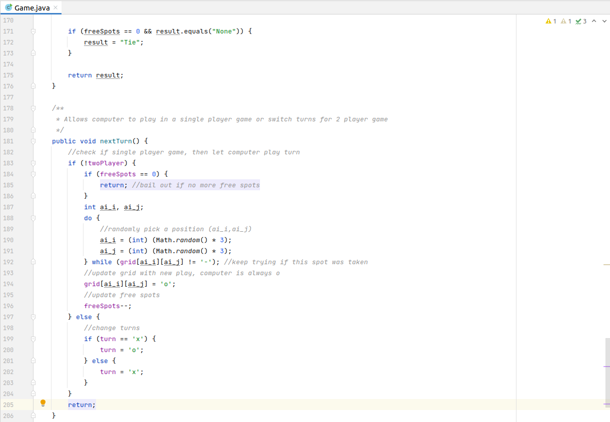
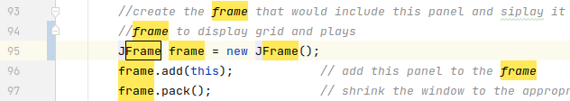

# Inspect Code
## Means to Find and Correct Problems in IntelliJ
### Do batch inspection
Choose Code -> Inspect Code menu, and run it on your project or other scope you intend to.



And the results:




Please note that you may get more warnings if you install more modules to IntelliJ. In the
above example, you can see *Shell script* warnings which are not visible with default IntelliJ
installation. There is a 3rd party module for Windows ```.bat``` batch files as well.

### Resolve Issues within Inspection Results
Some of the problems can be solved by the default action available in results. Example:




### Open File in Editor from Insepction Results
If the default solution is not feasible, you can still double-click the problem to open the file in editor.

For example, if there really is a typo in a text, it can only be corrected by editing the source:



In this case, double click on *Typo: in word 'boundries'* to open Game.java and position cursor at the
word in question, and make the correction there.

### Finding and Solving Problems in Editor

Editor window indicates the number of problems as well as the location of problems next the scrollbar.



Pressing ```F2``` repeatedly in Editor window puts the cursor at the next problem in the given file,
and opens a menu with default action and more actions.

**Important**: ```F2``` will only jump to a lower prority problem, when
no higher priority problem is present. For example, if you have a syntax error in your file,
```F2``` *will not* jump to typos or warnings, and will cycle through errors only.


## Solutions

### Typos

* to be corrected: *boundries*
* to be added to dictionary or ignored: *Dorg* in gradlew.bat, as it is a parameter: ```-Dorg.gradle.appname...```
* to be certainly added to dictionary: *asser*, as it is the name of the author in ```GameTest.java``` 

### param 'game' description is missing in GameUI constructor JavaDOC
There is a documentation generator tool called [Javadoc](https://www.oracle.com/technical-resources/articles/java/javadoc-tool.html).
This tool can automatically create documentation of classes and methods from a specifically formatted comment at the given block of code.
This comment is missing a description of method parameter ```game``` for constructor method ```GameUI```.

Example solution:

            * @param game instance of Game this UI should display and interact with


### GameUI.frame: Field can be converted to local variable 
If you right click on ```frame``` variable and choose *Find Usages*, you can see that this class variable
is only accessed within a single method - the constructor in this particular example.
This means that it might be defined in that method as a local variable, reducing the overall complexity of the class itself.




### Game.nextTurn: unnecessary last return statement in 'void' method

The last ```return``` statement is clearly unnecessary, as we do not expect any return values.
However, there is another ```return``` earlier that cannot be simply removed.\*

\**There is an argument that a method should only have a single return statement, as multiple returns can confuse
the person who reads the code. 
They can certainly be avoided by ```if-then-else``` and ```break```statement in ```for``` loops,
but they might increase the visual complexity of the given method.
In the end, you should choose the appropriate statement that improves code readability.*

### GameUI.panelMouseClicked: unnecessary last return statement in 'void' method
This one is a little bit more interesting, as the ```return``` statement is within an ```if-then``` block.
If you remove the ```return``` statement, then the ```if``` block itelf becomes obsolete too.


*One might ask: why would anyone put such a clearly unnecessary statement at the end of the method? The probable answer is: it is
the result of a refactor. If this method was originally a loop within an other method, and was later refactored into a method of
its own, and the code was simply copied there and this part was simply left there by mistake.*

### Anonymous new ActionListener() can be replaced with lambda
[Lambda Expressions](https://www.w3schools.com/java/java_lambda.asp)
can help reduce code complexity by providing simplified syntax for local anonymous functions.

Just go ahead and accept IntelliJ's recommended solution and convert to lambda, the result should look like this:

            newGameButton.addActionListener(e -> newGameButtonPressed(false));

Do not forget to remove the now unused import statements - pressing ```F2``` after making the above change get you there.

### Argument 'classLoader.getResourceAsStream("...png")' might be null
**This one is an important problem, as it can cause a NullPointerException, for which java programs are infamous for**.
We will deal with it in a dedicated exercise. For now simply ignore it.

### Method 'checkGameWinner' is too complex to analyze by data flow algorithm

There are situations where IntelliJ cannot reliably analyze data flow. In this particular example, *IntelliJ is right*.
     The method is too complex by all means. We will ignore this one for now, as it can only be resolved by refactoring
     this method, which we will do later.


