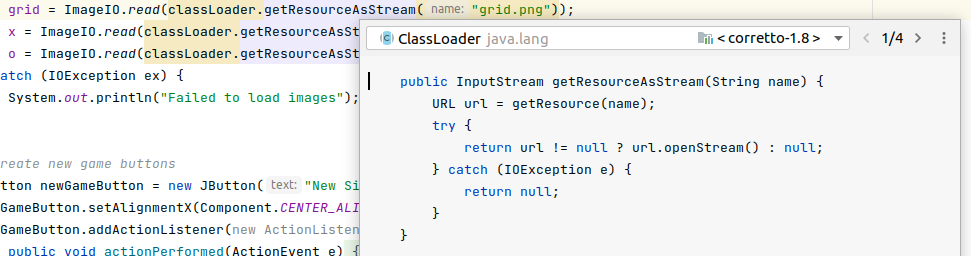
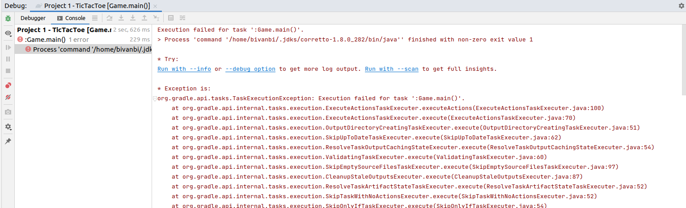
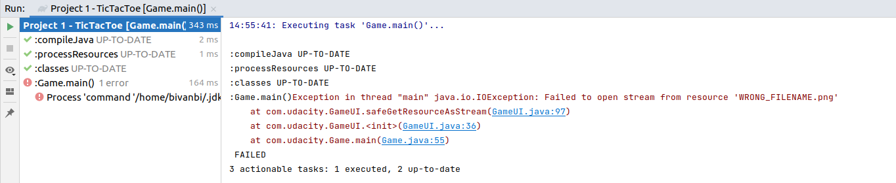

# Deal with Possible NullPointerException

## Argument 'classLoader.getResourceAsStream("...png")' might be null
One might say that in the given project, this failure is not very likely to happen, as there are only three image files that should be
present in the JAR file after building, so it is almost 100% that the files will be there. *Almost*.

While this is true, just for the sake of developing a good habit towards *not letting NullPointerException happen*, let's just fix it.


## Finding out how it can be null
With the help of IntelliJ, we can figure it out how this might happen.

Position the cursor on the problematic call and press ```ctrl+shift+i``` to see the code snippet of
```getResourceAsStream()``` method:



As you can see in the code snippet above, root cause is ```ClassLoader.getResourceAsString()``` returning
a null value if if there is something wrong with the requested resource. This can happen if the filename
is wrong, the file is missing etc. How much more helpful would an error message be saying 'x.png not found'
than a generic NullPointerException...

## Trigger the Error

To see what would happen if the image was missing, we can 'simulate' an error by mis-typing an image name on purpose.

           grid = ImageIO.read(classLoader.getResourceAsStream("WRONG_FILENAME.png"));

Try to run tests first and see what happens:
```
----------------------------------------------------------------------
|  Results: SUCCESS (23 tests, 23 successes, 0 failures, 0 skipped)  |
----------------------------------------------------------------------
```

Notice how this problem goes unnoticed by the current tests available, as they only test Game.java.


Now try to run the program:
```
bivanbi@bfpc:~/src/kign/ud282/Project 1 - TicTacToe$ java -jar build/libs/TicTacToe.jar 
Exception in thread "main" java.lang.IllegalArgumentException: input == null!
	at java.desktop/javax.imageio.ImageIO.read(ImageIO.java:1356)
	at com.udacity.GameUI.<init>(GameUI.java:36)
	at com.udacity.Game.main(Game.java:54)
```
Not very helpful, right?

The same in IntelliJ, with *stack trace* enabled:




## IntelliJ's recommended solution is not any better

IntelliJ's recommended solition:

            grid = ImageIO.read(Objects.requireNonNull(classLoader.getResourceAsStream("grid.png")));

It is not really helpful here, as it will still cause NullPointerException:

```
bivanbi@bfpc:~/src/kign/ud282/Project 1 - TicTacToe$ java -jar build/libs/TicTacToe.jar 
Exception in thread "main" java.lang.NullPointerException
	at java.base/java.util.Objects.requireNonNull(Objects.java:221)
	at com.udacity.GameUI.<init>(GameUI.java:37)
	at com.udacity.Game.main(Game.java:54)
```


*In some situations, the above workaround it might help to pinpoint the location earlier.*

## The Useless Catch Block

You might notice that there is a catch block in our method:

```
        // load images from resources files
        try {
            ClassLoader classLoader = GameUI.class.getClassLoader();
            grid = ImageIO.read(classLoader.getResourceAsStream("WRONG_FILENAME.png")));
            x = ImageIO.read(classLoader.getResourceAsStream("x.png"));
            o = ImageIO.read(classLoader.getResourceAsStream("o.png"));
        } catch (IOException ex) {
            System.out.println("Failed to load images: " + ex.toString());
        }
```

Problem is, it will never catch NullPointerException. If it would, it would help with the information
that it is the images that failed to load. But which one?


## Fail Early - the Real Deal

We could follow the 'fail early' approach here, and display an error at the earliest we detect a problem, and
show a meaningful error message when doing so.

An example fix for that could be to create a method that would throw an exception if resource open fails:
```
    private java.io.InputStream safeGetResourceAsStream(String resourceName) throws IOException {
        ClassLoader classLoader = GameUI.class.getClassLoader();
        InputStream stream = classLoader.getResourceAsStream(resourceName);
        if (stream == null) {
            throw new IOException(String.format("Failed to open stream from resource '%s'", resourceName));
        }
        return stream;
    }
```

and call it in our constructor instead of ```classLoader.getResourceAsStream()```:
```
        try {
            grid = ImageIO.read(this.safeGetResourceAsStream("WRONG_FILENAME.png"));
            x = ImageIO.read(this.safeGetResourceAsStream("x.png"));
            o = ImageIO.read(this.safeGetResourceAsStream("o.png"));
        } catch (IOException ex) {
            System.out.println("Failed to load images");
        }
```

Let's try it!
The result:
```
bivanbi@bfpc:~/src/kign/ud282/Project 1 - TicTacToe$ java -jar build/libs/TicTacToe.jar 
Failed to load images
```

Ok, at least our program has not crashed, and is actually playable, although there is no visual feedback whatsoever,
so anyone playing it would not be too happy about it.

We could build an extensive error handling mechanism here, but let's just get rid of the ```Catch``` block for now and let
our application crash with a meaningful message:

```
    public GameUI(Game game) throws IOException {

        this.game = game;

        grid = ImageIO.read(this.safeGetResourceAsStream("WRONG_FILENAME.png"));
        x = ImageIO.read(this.safeGetResourceAsStream("x.png"));
        o = ImageIO.read(this.safeGetResourceAsStream("o.png"));
```

Now try to build it:
```
> Task :compileJava FAILED
/home/bivanbi/Dropbox/src/kign/ud282/Project 1 - TicTacToe/src/main/java/com/udacity/Game.java:54: error: unreported exception IOException; must be caught or declared to be thrown
        gui = new GameUI(game);
              ^
1 error
```

That is because we need to update all other methods as well that use our GameUI class to either handle the exception
or declare ```throws IOException``` in its signature. Let's fix Game.java:

```
    public static void main(String[] args) throws IOException {
        Game game = new Game();
        gui = new GameUI(game);
    }
```

Build and run:

```
bivanbi@bfpc:~/src/kign/ud282/Project 1 - TicTacToe$ java -jar build/libs/TicTacToe.jar 
Exception in thread "main" java.io.IOException: Failed to open stream from resource 'WRONG_FILENAME.png'
	at com.udacity.GameUI.safeGetResourceAsStream(GameUI.java:97)
	at com.udacity.GameUI.<init>(GameUI.java:36)
	at com.udacity.Game.main(Game.java:55)
```




Our game still does not work, but the message is so much more meaningful.

Please note that hard-coding exception messages like this is still not necessarily a good practice. For instance,
when you you try to implement your applications in other languages. But for the time being, it will
suffice.

## Restore Good Filename Before Committing

Restore the original filename before committing and make sure your program runs as expected.
Also check for unused imports and other problems that may be the result of our modifications.


