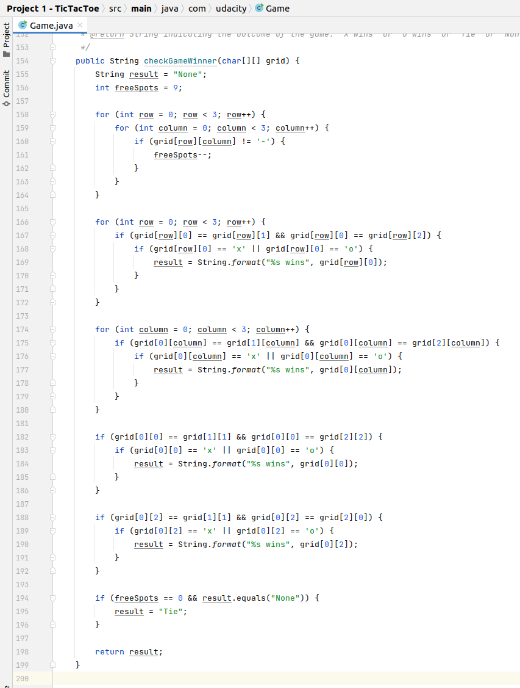

# Preparation

## Development Environment
To successfully complete these exercises, you will need to have
Java, Git and IntelliJ installed on your computer.


### Windows and MacOS
The installation process is outlined in Udacity's free courses:

* Java and IntelliJ: [Java Programming Basics course](https://www.udacity.com/course/java-programming-basics--ud282)
* Git: [Version Control with Git](https://www.udacity.com/course/version-control-with-git--ud123)


### Ubuntu 18.04 and above
If you are using Ubuntu 18.04 and above:
Open a terminal window (Win button + type in: terminal or press ctrl+alt+t) and do:

```
sudo snap install intellij-idea-community --classic
sudo apt-get install git gradle openjdk-8-jdk
```

### Any other system
Use your package manager or install from source.

* [Git Source Code](https://github.com/git/git)
* [Java JDK](https://java.com/en/)
* [Gradle](https://gradle.org/releases/)
* [IntelliJ](https://www.jetbrains.com/idea/download)

## Starter Code 

You should have downloaded [Starter Code](https://github.com/udacity/ud282) from Udacity's GitHub
repository and already completed the ```//Student code goes here ...```
section in ```checkGameWinner()``` method.

If your solution is not working as expected or you just dropped by, you can use
the example solution below.

### Update ```Game.java``` method ```checkGameWinner()```

Replace ```//Student code goes here...``` with the code below:
```
        int freeSpots = 9;

        for (int row = 0; row < 3; row++) {
            for (int column = 0; column < 3; column++) {
                if (grid[row][column] != '-') {
                    freeSpots--;
                }
            }
        }

        for (int row = 0; row < 3; row++) {
            if (grid[row][0] == grid[row][1] && grid[row][0] == grid[row][2]) {
                if (grid[row][0] == 'x' || grid[row][0] == 'o') {
                    result = String.format("%s wins", grid[row][0]);
                }
            }
        }

        for (int column = 0; column < 3; column++) {
            if (grid[0][column] == grid[1][column] && grid[0][column] == grid[2][column]) {
                if (grid[0][column] == 'x' || grid[0][column] == 'o') {
                    result = String.format("%s wins", grid[0][column]);
                }
            }
        }

        if (grid[0][0] == grid[1][1] && grid[0][0] == grid[2][2]) {
            if (grid[0][0] == 'x' || grid[0][0] == 'o') {
                result = String.format("%s wins", grid[0][0]);
            }
        }

        if (grid[0][2] == grid[1][1] && grid[0][2] == grid[2][0]) {
            if (grid[0][2] == 'x' || grid[0][2] == 'o') {
                result = String.format("%s wins", grid[0][2]);
            }
        }

        if (freeSpots == 0 && result.equals("None")) {
            result = "Tie";
        }
```


**The resulting code should look like this:**



[View solution on GitHub](https://github.com/bivanbi/ud282/blob/e00-starter-code/Project%201%20-%20TicTacToe/src/main/java/com/udacity/Game.java)
